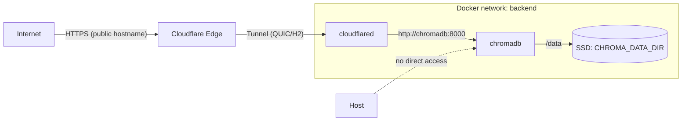

# chromadb-cloudflared

Minimal [ChromaDB](https://docs.trychroma.com/) on Docker, exposed to the internet only through a [Cloudflare Tunnel](https://developers.cloudflare.com/cloudflare-one/connections/connect-networks/) (`cloudflared`). There is no reverse proxy, no published host port for Chroma: the database listens on `http://chromadb:8000` inside a private Docker bridge network, and traffic enters only after Cloudflare terminates HTTPS on your public hostname.



### Repository layout

```
chromadb-cloudflared/
├── compose.yml          # chromadb + cloudflared services
├── Makefile             # loads .env (optional), includes make/*.mk
├── make/
│   ├── variables.mk     # defaults (CHROMA_DATA_DIR, colors, PROJECT_NAME)
│   ├── docker.mk        # start, stop, logs, create-data-dir, etc.
│   └── help.mk          # printable help
├── AGENTS.md            # contributor / agent conventions
├── .env.template        # placeholder env (copy to .env)
└── README.md
```

### Components

**`chromadb`**

- Image: `chromadb/chroma:1.5.4` (pinned; validate before upgrading).
- Listens on port `8000` **inside** the `backend` network only (no `ports:` on the host).
- Persists data via bind mount: host `${CHROMA_DATA_DIR}` → container `/data`.
- Healthcheck: `GET http://localhost:8000/api/v2/heartbeat` inside the container.
- Hardening: `security_opt: no-new-privileges`, `tmpfs` on `/tmp`, log rotation (`10m` × 3 files).

**`cloudflared`**

- Runs `tunnel run` with `TUNNEL_TOKEN` from your environment.
- Joins the same `backend` network and reaches Chroma at `http://chromadb:8000`.
- Starts only after `chromadb` is healthy (`depends_on` with `condition: service_healthy`).
- Sets `TUNNEL_MANAGEMENT_DIAGNOSTICS=false` (see [cloudflared CHANGES](https://github.com/cloudflare/cloudflared/blob/master/CHANGES.md)).

## Prerequisites

- [Docker](https://docs.docker.com/get-docker/) and the **Docker Compose v2** plugin (`docker compose`, not the legacy `docker-compose` v1 CLI).
- A [Cloudflare Tunnel](https://developers.cloudflare.com/cloudflare-one/connections/connect-networks/) and its **token** (Zero Trust → Networks → Tunnels).
- A host directory for Chroma data (absolute path), created **before** first `docker compose up`.

## Getting started

1. **Environment**

   ```sh
   cp .env.template .env
   ```

   Edit `.env` and set:

   - `CHROMA_DATA_DIR` — absolute path on the host (for example `/srv/chroma-data`).
   - `TUNNEL_TOKEN` — your tunnel token (never commit this file).

   ```sh
   make create-data-dir
   ```

   This uses `CHROMA_DATA_DIR` from `.env` if the file exists, otherwise the default in `make/variables.mk` (`/srv/chroma-data`). You can still run `mkdir -p` yourself if you prefer.

2. **Cloudflare dashboard**

   For the tunnel’s public hostname, set the service URL to **`http://chromadb:8000`** (Docker service name and internal port). Do **not** point the tunnel at `localhost` or a host LAN address unless you deliberately change the architecture; in this stack, only `cloudflared` talks to Chroma on the Docker network.

3. **Run**

   ```sh
   make docker-check
   make start
   ```

   Follow logs with `make logs`. Default Make target is `help`.

## Make commands

| Command       | Description |
|---------------|-------------|
| `help`        | Show available commands (default target). |
| `docker-check`| Verify Docker and `docker compose` are installed. |
| `create-data-dir` | Create `CHROMA_DATA_DIR` on the host (`mkdir -p`; reads `.env` when present). |
| `start`       | Start ChromaDB and cloudflared (`docker compose up -d`). |
| `stop`        | Stop all compose services. |
| `restart`     | Recreate the stack (`down` then `up -d`). |
| `logs`        | Follow container logs. |
| `clean`       | Stop services and remove compose-managed volumes and orphans. |

## Network and ports

| Service      | Inside Docker     | Published on host |
|--------------|-------------------|-------------------|
| `chromadb`   | `8000` (HTTP API) | **None**          |
| `cloudflared`| (outbound tunnel) | **None**          |

Clients on the internet reach Chroma only through your **Cloudflare hostname** (HTTPS at the edge). The host machine has no direct LAN/WAN port open to the Chroma API.

## Environment variables

Only these variables are used (see [AGENTS.md](AGENTS.md) for the full contract):

| Variable           | Required | Description |
|--------------------|----------|-------------|
| `CHROMA_DATA_DIR`  | Yes      | Absolute host path for persistence; mounted as `/data` in the Chroma container. Must exist before startup. |
| `TUNNEL_TOKEN`     | Yes      | Cloudflare Tunnel token for `cloudflared`. |

Do not add extra variables to compose without updating `.env.template` and `AGENTS.md`.
